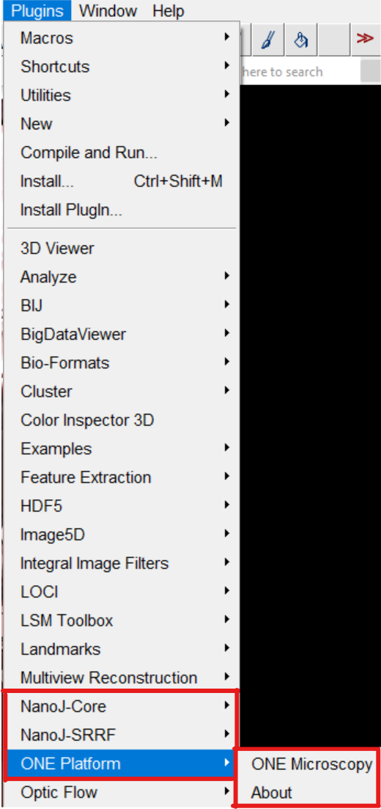

# ONE Microscopy's Fiji Java Plugin

## About

**ONE Microscopy** is a Java-written software that utilizes Fiji app and is built on top of [NanoJ-Core](https://github.com/HenriquesLab/NanoJ-Core) and [NanoJ-SRRF](https://github.com/HenriquesLab/NanoJ-SRRF) which are developed by [HenriquesLab](https://github.com/HenriquesLab).\
\
Developed by **Abed Chouaib, University of Saarland, Homburg Saar, Germany**, for **Ali Shaib and Silvio Rizzoli, University Medical Center Göttingen, Germany**. Further Driver compatibility and library updates by **Mohamad Mahdi Alawieh, University Medical Center Göttingen, Germany**.


## Quick Links

- [Installation guide](#installation-guide)
- [Screenshots](#screenshots)
- [Usage and Parameters](#usage-and-parameters)
	- [Main Interface Parameters](#main-interface-parameters)
   	   - [File Imports](#file-imports)
   	   - [Analysis Parameters](#analysis-parameters)
   	   - [Temporal Analysis Mode](#temporal-analysis-mode)
   	- [Advanced Settings](#advanced-settings)
- [Citations](#citations)
   

# Installation guide

To install ONE, kindly click [here](https://github.com/Rizzoli-Lab/ONE-Microscopy-Java-Plugin/releases) and grab the zip file for latest version available.

>❗ **Note**: This plugin's dependencies use a newer version of xalan (v2.7.3) in order to function. Make sure there are no other instances of xalan present in the **jar** folder in Fiji's directory (e.g xalan v2.7.2 which is bundled with Fiji).

>❗ **Note**: ONE includes/bundles an updated version of [NanoJ-Core](https://github.com/HenriquesLab/NanoJ-Core) and [NanoJ-SRRF](https://github.com/HenriquesLab/NanoJ-SRRF) that supports running on newer GPU drivers. If you already have **NanoJ_Core.jar, NanoJ_Updater.jar and NanoJ_SRRF.jar** inside the **plugins** folder, kindly remove them as they will result in conflicting files on Fiji's startup.

After installing the zip file from [Releases](https://github.com/Rizzoli-Lab/ONE-Microscopy-Java-Plugin/releases) and extracting, place the folders/files as shown below:

> **Note**: "✔️" refers to files that should be added. "❌" refers to files that should be removed. 

```
.
└── Fiji/
    ├── jars/
    │   ├── ✔️aparapi.jar
    │   ├── ✔️aparapi-jni.jar
    │   ├── ✔️JGoogleAnalytics_0.4.jar
    │   ├── ✔️JTransforms-3.1-with-dependencies.jar
    │   ├── ✔️junit-4.8.1.jar
    │   ├── ✔️xalan-2.7.3.jar
    │   └── ❌xalan-2.7.x.jar
    ├── luts/
    │   ├── ✔️NanoJ-Orange.lut
    │   ├── ✔️SQUIRREL-Errors.lut
    │   └── ✔️SQUIRREL-FRC.lut
    └── plugins/
        ├── ✔️ONE_Microscopy.jar
        ├── ❌NanoJ_Core.jar
        ├── ❌NanoJ_Updater.jar
        └── ❌NanoJ_SRRF.jar
        
```

# Screenshots

If all files were placed correctly in their respective folders, your list of plugins in Fiji should contain:




# Usage and Parameters

## Main Interface Parameters

#### <ins>File Imports</ins>

| Parameter             	| Default               	| Explanation                                                                                                                                              	|
|-----------------------	|:-----------------------:	|----------------------------------------------------------------------------------------------------------------------------------------------------------	|
| Video                 	| Disabled              	| Use when analysis is to be done on a single video file.                                                                                                  	|
| Multi-video           	| Enabled               	| Use when analysis is to be done on multiple video files.                                                                                                 	|
| Olympus files         	| Disabled              	| Use when analyzing Olympus files                                                                                                                         	|
| Save in parent folder 	| Enabled               	| Saves the output in the same parent directory of the input folder. In case of single video analysis, it will save the output folder  in the same folder. 	|
| Start from video      	|           	1           	| Which video from the multipler input videos to start analysis from                                                                                       	|
| End on video          	| Length of video files 	| Which video to analyze the last.                                                                                                                         	|

#### <ins>Analysis Parameters</ins>

| Parameters              	| Default Value 	| Explanation                                                                                                                                                                     	|
|-------------------------	|:-------------:	|---------------------------------------------------------------------------------------------------------------------------------------------------------------------------------	|
| Channels to process     	|    0 (auto)   	| Which channel to run the analysis on. 0 runs analysis on all channels.                                                                                                          	|
| Drift channel reference 	|    0 (auto)   	| which channel to use as reference for drift correction. 0 uses the drift of each respective channel.                                                                            	|
| Frames to analyze       	|    0 (auto)   	| how many frames to analyze from the original video.                                                                                                                             	|
| Radiality Magnification 	|       10      	| how many magnified pixels are the original pixels split into. If a video consists of 128x128 pixels, a 10 Radiality Magnification will result in a video with 1280x1280 pixels. 	|
| Ring Axes               	|       8       	| Higher Ring Axes leads to greater fidelity at the cost of extra  computational time.                                                                                            	|
| Temporal Analysis Mode  	|      TRAC     	| See table below for more information.                                                                                                                                           	|
| TRAC Order              	|       4       	| Preforms TRAC based on the given order. Higher order leads to higher resolution.                                                                                                	|
| Distance to Scale       	|    0 (auto)   	| Original resolution of the input video per unit.                                                                                                                                	|
| Known Distance          	|       1       	| In case Scaled Distance is inconsistent, set the known distance using this parameter                                                                                            	|
| Expansion Factor        	|      1.0      	| In case of expansion, set the value to the relative expansion factor.                                                                                                           	|

#### <ins>Temporal Analysis Mode</ins>

| Temporal Analysis Mode                           	| Explanation                                                                                                                                      	|
|--------------------------------------------------	|--------------------------------------------------------------------------------------------------------------------------------------------------	|
| Temporal Radiality Average (TRA)                 	| Returns the analyzed image as an average intensity projection of the radiality transforms belonging to each original frame from the input video. 	|
| Temporal Radiality Maximum (TRM)                 	| Returns the analyzed image as a maximum intensity projection of the radiality transforms belonging to each original frame from the input video.  	|
| Temporal Radiality Pairwise Product Mean (TRPPM) 	| Returns the analyzed image as the raw second moment (related to the variance)  of the radiality integrated over time.                            	|
| Temporal Radiality Auto-Correlations (TRAC)      	| Returns the analyzed image after performing auto-correlation analysis of given order.                                                            	|


## Advanced Settings

| Setting                         	| Default  	| Explanation                                                                                                                                                          	|
|---------------------------------	|----------	|----------------------------------------------------------------------------------------------------------------------------------------------------------------------	|
| Integrate Temporal Correlations 	| Enabled   	| Should be kept on in cases where individual fluorophores can reappear at later frames in the video.                                                                  	|
| Remove Positvity Constraint     	| Enabled  	| Removes Positivity Constraint by default. When ticked, it is used to increase contrast in single frame radiality analysis where temporal statistics are not applied. 	|
| Renormalize                     	| Disabled 	| Enable when using 2D structures.                                                                                                                                     	|
| Do Gradient Smoothing           	| Enabled 	| Activate in low density, adds a smoothing effect but decreases spatial resolution.                                                                                   	|
| Do Intensity Weighting          	| Enabled   	| Used to enhance radiality peaks resulting from high intensity regions.                                                                                               	|
| Do Gradient Weighting           	| Enabled 	| Activate in low-SNR                                                                                                                                                  	|
| Minimize SRRF Patterning        	| Enabled  	| Used to minimize patterning resulting from SRRF analysis                                                                                                             	|


## Citations

Upon using, modifying or incorporating parts of ONE Platform, please cite the following reference:

> Shaib <i>et al.</i> Visualizing proteins by expansion microscopy, 2022. BioRxivs https://doi.org/10.1101/2022.08.03.502284
			
The software relies on the following open-source algorithms that we highly recommend to cite:

- > Gustafsson, N. <i>et al.</i> Fast live-cell conventional fluorophore nanoscopy with ImageJ through super-resolution radial fluctuations. Nat Commun 7, 12471 (2016). https://doi.org:10.1038/ncomms12471
- > Laine, R. F. <i>et al.</i> High-fidelity 3D live-cell nanoscopy through data-driven enhanced super-resolution radial fluctuation. <i>Nat Methods</i> <b>20</b>, 1949–1956 (2023). https://doi.org/10.1038/s41592-023-02057-w
- > K. Li, "The image stabilizer plugin for ImageJ," February, (2008). http://www.cs.cmu.edu/~kangli/code/Image_Stabilizer.html
- > Linkert, M. <i>et al.</i> Metadata matters: access to image data in the real world. J Cell Biol 189, 777-782 (2010). https://doi.org:10.1083/jcb.201004104
- > Schindelin, J., Arganda-Carreras, I., Frise, E. et al. Fiji: an open-source platform for biological-image analysis. *Nat Methods* **9**, 676–682 (2012). https://doi.org/10.1038/nmeth.2019


 
